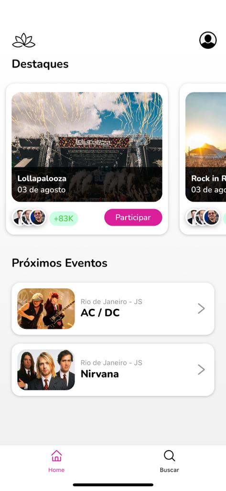
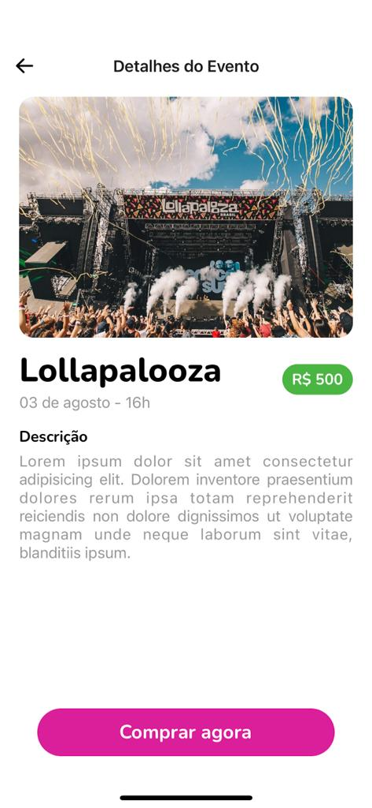

# Aplicativo para eventos

Aplicativo desenvolvido para gestão de eventos. <br/>
Através do APP o usuário pode buscar e realizar a compra do seu ingresso para algum evento.

O layout foi desenvolvido com base no design do <a href="https://dribbble.com/farissetiawan" target="_blank">Faris</a> com algumas modifições.
<br/>
Além de inspirações no design do <a href="https://dribbble.com/vlockn" target="_blank">Vishnu Prasad</a> e no APP do Prime Video.

<br/>

<div style="display:flex; flex-direction:row; align-items:center; justify-content:space-between">
  
  
</div>
<br/>
<br/>
Instruções para executar o projeto:

- Clone o projeto na sua máquina;
- Instale os pacotes com: yarn ou npm install;
- Execute o comando para rodar os testes: ```yarn test``` ou ```npm run test``` ;
- Execute o comando para inicializar o APP: ```yarn start``` ou ```npm run start```;
- Abra o APP em um emulador no seu computador, ou aponte o seu aparelho físico, com o Expo Go instalado. para o QR Code que irá aparecer no termninal.
